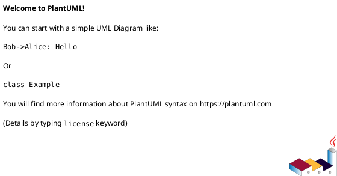

# Log4Lib

A simple logging library for libraries in C++23. It will allow you to log messages in your library without providing
a log engine such as spdlog, syslog, or any other logging library. It is designed to be easy to use and integrate into
your library, and it provides a simple interface for logging messages at different levels of severity.
It gives you or the client of your library the flexibility to choose the logging engine that best suits their needs.
All that is required is a simple include and a few lines of code to start logging.

# Architecture

